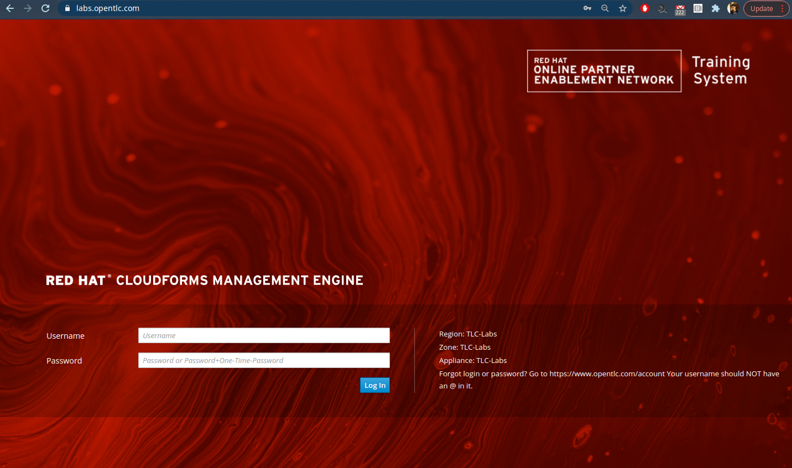
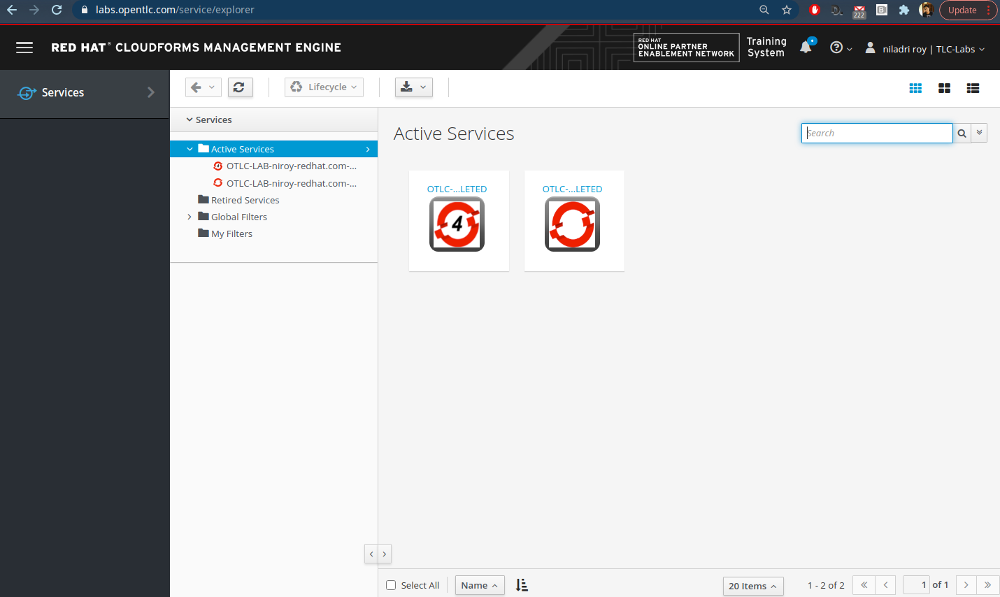
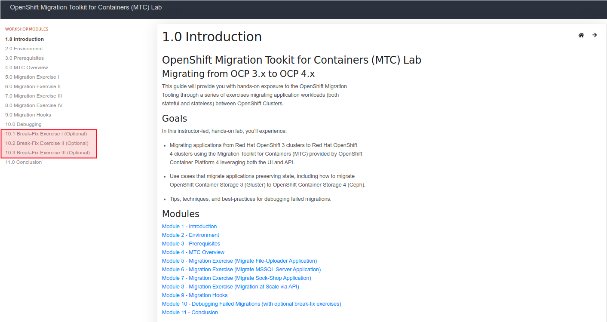

# OpenShift Migration Tookit for Containers (MTC) Lab

This guide will provide you with hands-on exposure to the new OpenShift Migration Tooling through a series of labs migrating application workloads (both stateful and stateless) between OpenShift Clusters.

## Description

Migrates application workloads from Cluster A to Cluster B (includes ui, controller, Velero/Restic, plugins, etc). This application is available for installation through the Operator Hub/OLM. This course requires both the CAM OCP3 and OCP4 services from OPENTLC.

## Goals

* Migrating applications from Red Hat OpenShift 3 clusters to Red Hat OpenShift
4 clusters using the Migration Toolkit for Containers (MTC) provided by OpenShift
Container Platform 4 leveraging both the UI and API.

* Use cases that migrate applications preserving state, including how to migrate
OpenShift Container Storage 3 (Gluster) to OpenShift Container Storage 4 (Ceph).

* Tips, techniques, and best-practices for debugging failed migrations.

## Setup Steps

Step 1: Step 1: Browse to OPENTLC: https://labs.opentlc.com/



Step 2: Login with your OPENTLC username/password.

Step 3: Browse to Services >> Catalogs and open the “OPENTLC OpenShift 4 Labs” catalog.

Step 4: Order two services as follows:

* Migration Toolkit for Containers (OCP3)
* Migration Toolkit for Containers (OCP4)

Step 5: Wait for both services to become available.  ```This will take ~75 min.```



Step 6: Open a terminal window with two tabs.  One tab for the source OCP3 cluster and one tab for the destination OCP4 cluster.

Step 7: In the OCP3 tab, ssh into the OCP3 bastion host using the information provided in OPENTLC for the provisioned service.

```bash
$ ssh niroy-redhat.com@bastion.ed3e.example.opentlc.com
The authenticity of host 'bastion.ed3e.example.opentlc.com (18.140.186.43)' can't be established.
ECDSA key fingerprint is SHA256:snlMfzwrQfL7CGJXLkTq+kYnsTjH1nHeUjyZhZr/rX4.
Are you sure you want to continue connecting (yes/no/[fingerprint])? yes
Warning: Permanently added 'bastion.ed3e.example.opentlc.com,18.140.186.43' (ECDSA) to the list of known hosts.
niroy-redhat.com@bastion.ed3e.example.opentlc.com's password: 
```
In the home directory, locate the cluster.info file.

Step 8: In the OCP4 tab, ssh into the OCP4 bastion host using the information provided in OPENTLC for the provisioned service.

```bash
$ ssh niroy-redhat.com@bastion.4a97.sandbox824.opentlc.com
The authenticity of host 'bastion.4a97.sandbox824.opentlc.com (13.251.141.157)' can't be established.
ECDSA key fingerprint is SHA256:jCWss4ZtonOsrammBVcd9lXGHQUCtXQC+QQgKpQmWps.
Are you sure you want to continue connecting (yes/no/[fingerprint])? yes
Warning: Permanently added 'bastion.4a97.sandbox824.opentlc.com,13.251.141.157' (ECDSA) to the list of known hosts.
niroy-redhat.com@bastion.4a97.sandbox824.opentlc.com's password: 
```

Step 9: In the home directory, locate the cluster.info file.  Edit the cluster.info file in the home directory adding in the OCP3 cluster.info information and save the file.

```
[OCP3]
guid=ed3e
domain=.example.opentlc.com
student_name=niroy-redhat.com


[OCP4]
guid=4a97
domain=.sandbox824.opentlc.com
student_name=niroy-redhat.com
```

Step 10:  In the OCP4 terminal tab, oc login to the OCP4 cluster using the information provided by OPENTLC:

```bash
$ oc login https://api.cluster-4a97.4a97.sandbox824.opentlc.com:6443 -u admin -p r3dh4t1!
The server uses a certificate signed by an unknown authority.
You can bypass the certificate check, but any data you send to the server could be intercepted by others.
Use insecure connections? (y/n): y

Login successful.

You have access to 55 projects, the list has been suppressed. You can list all projects with 'oc projects'

Using project "default".
Welcome! See 'oc help' to get started.
```

Step 11: In the OCP4 terminal tab , run the bookbag.yaml ansible playbook (also found in the home directory) to auto-generate the Lab documentation.

```
$ ansible-playbook bookbag.yml -e ocp3_password=r3dh4t1! -e ocp4_password=r3dh4t1!
[WARNING]: provided hosts list is empty, only localhost is available. Note that the implicit localhost does not match 'all'


PLAY [localhost] *****************************************************************************************************************************************************************************************************************************

TASK [Gathering Facts] ***********************************************************************************************************************************************************************************************************************
ok: [localhost]

TASK [fail] **********************************************************************************************************************************************************************************************************************************
skipping: [localhost]

TASK [Reading cluster information file] ******************************************************************************************************************************************************************************************************
ok: [localhost]

TASK [Creating bookbag project] **************************************************************************************************************************************************************************************************************
changed: [localhost]

TASK [set_fact] ******************************************************************************************************************************************************************************************************************************
ok: [localhost]

TASK [Fetching bookbag repo] *****************************************************************************************************************************************************************************************************************
changed: [localhost]

TASK [Building bookbag image] ****************************************************************************************************************************************************************************************************************
changed: [localhost] => (item=oc project lab-instructions)
changed: [localhost] => (item=oc process -f build-template.yaml -p GIT_REPO='https://gitlab.com/2020-summit-labs/openshift-migration-lab-bookbag.git' | oc apply -f -)
changed: [localhost] => (item=oc start-build bookbag --follow)

TASK [Deploying bookbag image] ***************************************************************************************************************************************************************************************************************
changed: [localhost]

TASK [Read bookbag route] ********************************************************************************************************************************************************************************************************************
changed: [localhost]

TASK [debug] *********************************************************************************************************************************************************************************************************************************
ok: [localhost] => {
    "msg": "Route to bookbag : bookbag-lab-instructions.apps.cluster-4a97.4a97.sandbox824.opentlc.com"
}

PLAY RECAP ***********************************************************************************************************************************************************************************************************************************
localhost                  : ok=9    changed=5    unreachable=0    failed=0    skipped=1    rescued=0    ignored=0 
```

Step 12: Launch the auto-generated bookbag documentation by browsing to the supplied route:



Step 13. Proceed with Lab by following steps outlined in bookbag documentation. This lab includes three optional break-fix exercises
